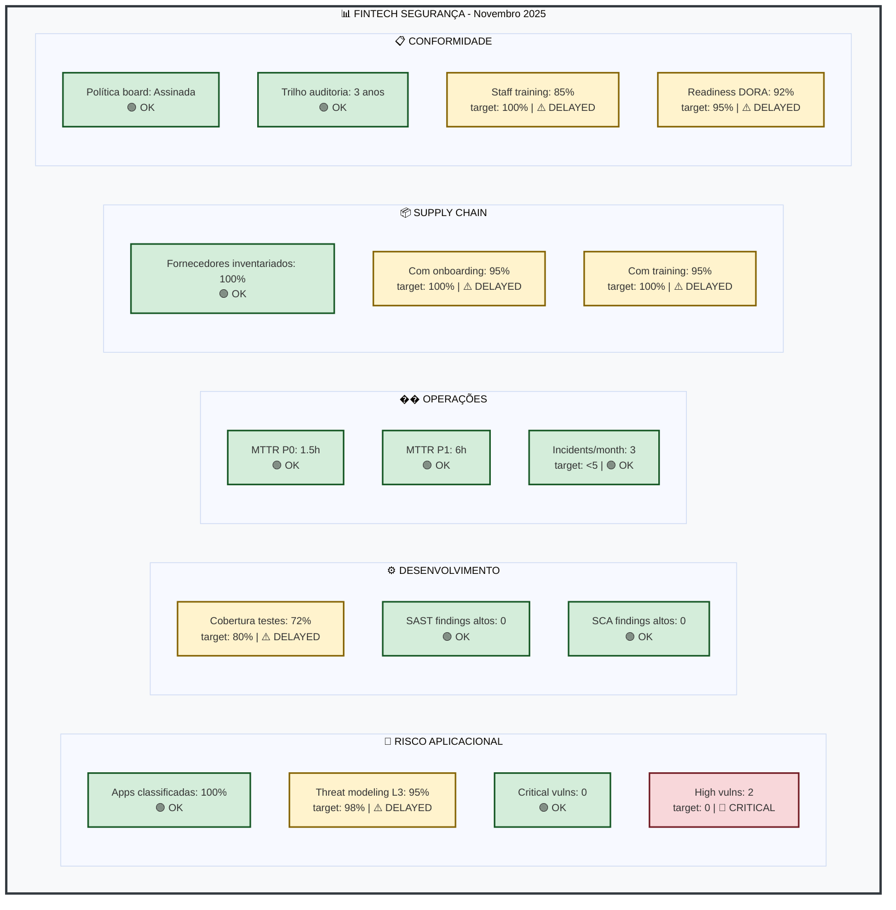
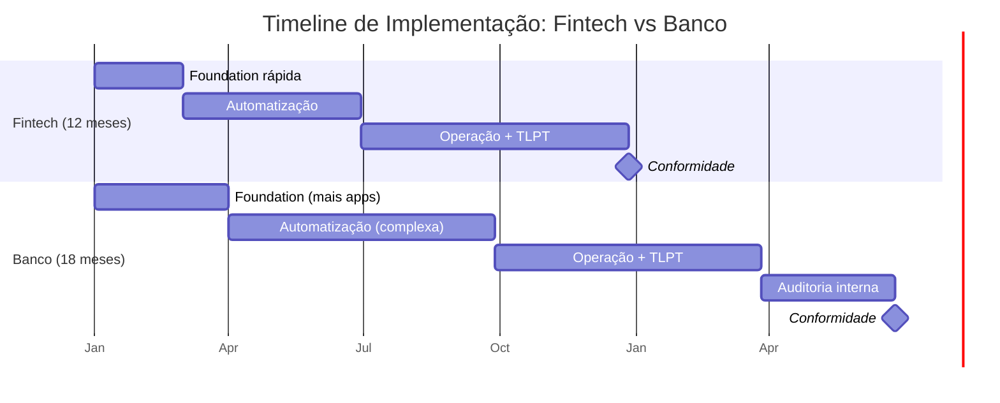
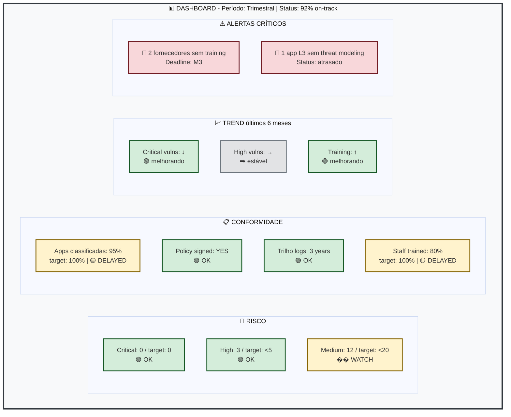

# Exemplo: KPIs e Targets

## Enquadramento

O SbD-ToE prescreve ([Cap. 12](/sbd-toe/sbd-manual/monitorizacao-operacoes/intro)):
- ✓ Métricas de segurança
- ✓ Monitorização contínua
- ✓ Melhoria baseada em dados

O SbD-ToE **NÃO prescreve** targets específicos porque contextos variam. Este documento apresenta **exemplos para diferentes tipos de organização**.

---

## Dimensões de KPIs (Todas as Organizações)

O manual define estas dimensões ([Cap. 12](/sbd-toe/sbd-manual/monitorizacao-operacoes/intro)):

1. **Risco Aplicacional** - Cobertura de ameaças
2. **Desenvolvimento** - Qualidade de código
3. **Operações** - Tempo de resposta
4. **Supply Chain** - Gestão de fornecedores
5. **Conformidade** - Evidência de auditoria

Para cada dimensão, apresentamos targets exemplares.

---

## Cenário 1: Fintech de Pagamentos (Startup, `<`50 devs)

### Contexto
- Serviço crítico: Processamento de pagamentos
- Deadline DORA: Janeiro 2025 (curto)
- Budget: Limitado
- Risk appetite: Baixo (pagamentos = PCI-DSS + DORA)

### KPIs e Targets

| Categoria | Métrica | Target | Período | Justificativa |
|-----------|---------|--------|---------|---------------|
| **Risco Aplicacional** | % apps classificadas | 100% | M1 | Urgente: DORA requer classificação |
| | Threat modeling (L3) | 100% | M3 | Antes de TLPT |
| | Vulns críticas não remediadas | 0 | Permanente | Pagamentos: zero tolerance |
| | Vulns altas não remediadas | 0 (ou `<`48h SLA) | Permanente | Impacto direto PCI |
| **Desenvolvimento** | Cobertura de testes | ≥80% | M6 | Progressivo: começar com funções críticas |
| | SAST findings altos | 0 | Permanente | Gate de CI/CD |
| | SCA findings altos | 0 | Permanente | Gate de CI/CD |
| **Operações** | MTTR P0 (Critical) | `<`2h | Permanente | Pagamentos: impacto direto |
| | MTTR P1 (High) | `<`8h | Permanente | Business impacto |
| | Incidents detetados/month | `<`5 | M12 | Reduzir com maturidade |
| **Supply Chain** | Fornecedores no inventário | 100% | M2 | DORA Art. 26 requer |
| | % com onboarding completo | 100% | M3 | Antes de acesso |
| | % com security trainning | 100% | M3 | Obrigatório antes acesso |
| **Conformidade** | Política assinada board | ✓ | M1 | DORA Art. 5 |
| | Trilho auditoria (logs) | 3 anos | M0 | Pré-requisito |
| | Staff SbD trainning | 100% devs | M4 | Ramp-up rápido |
| | Readiness inspeção | 95% | M12 | Antes inspeção supervisor |

### Dashboard (Exemplo visual)

---

## Cenário 2: Banco Tradicional (Regional, `>`200 devs)

### Contexto
- Apps críticas: `>`30 (múltiplas linhas de negócio)
- Deadline DORA: Janeiro 2025
- Budget: Adequado
- Risk appetite: Muito baixo (conformidade histórica)
- Compliance adicional: GDPR, NIS2, regulação local

### KPIs e Targets

| Categoria | Métrica | Target | Período | Justificativa |
|-----------|---------|--------|---------|---------------|
| **Risco Aplicacional** | % apps classificadas | 100% | M1 | Obrigatório DORA |
| | Threat modeling (L3) | 100% | M4 | Mais apps = tempo |
| | Threat modeling (L2) | 80% | M6 | Progressivo |
| | Vulns críticas não remediadas | 0 | Permanente | DORA + GDPR |
| | Vulns altas (SLA remediação) | `<`30 dias | Permanente | Conforme [Cap. 05](/sbd-toe/sbd-manual/dependencias-sbom-sca/intro) |
| | Vulns médias (SLA remediação) | `<`90 dias | Permanente | Conforme [Cap. 05](/sbd-toe/sbd-manual/dependencias-sbom-sca/intro) |
| **Desenvolvimento** | Cobertura de testes | ≥85% | M12 | Mais rigoroso: banco |
| | SAST findings altos | 0 | Permanente | Zero tolerance |
| | SCA findings altos | 0 | Permanente | Zero tolerance |
| | Code review rate | 100% | Permanente | Segregação duties |
| **Operações** | MTTR P0 (Critical) | `<`1h | Permanente | Impacto sistémico |
| | MTTR P1 (High) | `<`4h | Permanente | Impacto operacional |
| | Disponibilidade core apps | ≥99.95% | Permanente | SLA regulatório |
| | Incidents P0 resolvidos `<`24h | 100% | Permanente | Reporte DORA obrigatório |
| **Supply Chain** | Fornecedores no inventário | 100% | M1 | DORA Art. 26 |
| | % auditados (risk assessment) | 100% | M3 | DORA requer |
| | % com contrato atualizado | 100% | M6 | Cláusulas técnicas |
| | % com acesso revogado `<`24h | 100% | Permanente | Offboarding rigoroso |
| **Conformidade** | Política board + GDPR officer | ✓ | M0 | Pré-requisito |
| | Trilho auditoria (logs) | 5 anos | M0 | GDPR + DORA |
| | Staff SbD training | 100% devs | M6 | Maior volume |
| | Staff GRC training | 100% arquitetura | M3 | Entender normativos |
| | TLPT (L3 apps) | 100% | M12 | DORA Art. 19 |
| | Attestation TLPT | ✓ | M13 | Evidência board |
| | Readiness inspeção supervisor | 100% | M18 | Completa preparação |

### Novidade: Timeline Diferente

**Diferenças chave:**
- **Fintech:** 12 meses, foundation rápida (M0-M2), foco em velocidade
- **Banco:** 18 meses, foundation mais longa (M0-M3), mais apps e complexidade

---

## Cenário 3: Segurador Digital (PME, 20-50 devs)

### Contexto
- Apps: Subsistemas críticos (10-15 L3)
- Deadline DORA: Janeiro 2025
- Budget: Moderado
- Risk appetite: Baixo (seguros = dados sensíveis + GDPR)
- Compliance adicional: GDPR, regulação de seguros local

### KPIs e Targets

| Categoria | Métrica | Target | Período | Justificativa |
|-----------|---------|--------|---------|---------------|
| **Risco Aplicacional** | % apps classificadas | 100% | M1 | Obrigatório DORA |
| | Threat modeling (L3) | 100% | M3 | Menos apps = rápido |
| | Vulns críticas não remediadas | 0 | Permanente | GDPR + dados |
| | Vulns altas (SLA) | `<`15 dias | Permanente | Dados sensíveis |
| **Desenvolvimento** | Cobertura de testes | ≥75% | M6 | Pragmático para PME |
| | SAST findings altos | 0 | Permanente | Gate CI/CD |
| | SCA findings altos | 0 | Permanente | Gate CI/CD |
| **Operações** | MTTR P0 | `<`4h | Permanente | Seguros: impacto operacional |
| | MTTR P1 | `<`24h | Permanente | Menos crítico que banco |
| | Disponibilidade | ≥99.5% | Permanente | SLA comercial |
| **Supply Chain** | Fornecedores no inventário | 100% | M2 | DORA requer |
| | % com onboarding | 100% | M3 | Antes acesso |
| | % com training | 100% | M3 | Obrigatório |
| **Conformidade** | Política board | ✓ | M1 | DORA Art. 5 |
| | Trilho auditoria | 3 anos (GDPR) | M0 | |
| | Staff training | 100% | M4 | PME: todos conhecem |
| | TLPT readiness | Piloto L3 critical | M10 | Menos apps = pode fazer |
| | Readiness inspeção | 90% | M12 | Antes deadline DORA |

---

## Cenário 4: Empresa de Outsourcing/Serviços Financeiros

### Contexto
- Apps: Múltiplas soluções SaaS/On-prem
- Clientes: Diferentes perfis de risco
- Deadline DORA: Depende cliente
- Budget: Variável (por cliente)
- Desafio: Diferentes níveis de maturidade por cliente

### Approach: Targets por Tier

| Tier | Cliente | RTO | Vulns Altas SLA | TLPT | Training |
|------|---------|-----|-----------------|------|----------|
| **Essencial** | Banco pequeno | `<`4h | `<`30d | Sim | 100% |
| **Padrão** | PME financeira | `<`8h | `<`45d | Sim | 80% |
| **Básico** | Startup fintech | `<`24h | `<`60d | Piloto | 60% |

### Gestão de Clientes

**👤 Cada cliente tem:**
- Classificação apps (L1-L3)
- Policy própria (assinada)
- SLA customizado
- Timeline DORA específica
- KPIs rastreados em dashboard
- Relatório trimestral

**📊 Consolidação interna:**
- KPI agregado: % clientes compliant
- Risco agregado: Clientes em risco
- Training: Cobertura por região/cliente
- Alertas: Clientes que vão falhar deadline

---

## Componentes de Qualquer Dashboard

Independentemente do cenário, o dashboard deve ter:

### 📊 Dashboard Unificado

---

## Cadência de Revisão

### Mensal (Quick-check)
- Critical/High vulns
- Incidentes abertos
- Fornecedores sem onboarding

### Trimestral (Formal Review)
- KPIs contra targets
- Trends últimos 3 meses
- Ajustes de targets se needed
- Board reporting

### Anual (Strategic)
- Revisão de targets conforme DORA evolução
- Lições aprendidas vs. targets
- Projeção para próximo ano

---

## Processo de Definição de Targets (Por Fazer)

1. **Baseline:** Auditar estado atual
2. **Benchmarking:** Comparar com indústria (cuidado: contextos variam)
3. **Risk Assessment:** Definir risk appetite
4. **Proposal:** Apresentar ao management
5. **Aprovação:** Board sign-off
6. **Comunicação:** Publicar targets, comunicar timeline
7. **Monitorização:** Rastrear progresso
8. **Revisão:** Trimestral + anual

---

## Importante

**Não existem "targets certos"** - cada organização deve:

- Começar conservador (melhor exceder que falhar)
- Iterar conforme capacidade
- Alinhar com DORA requirements
- Comunicar trade-offs
- Documentar decisões

Targets são **propósito prático**, não teórico - servem para orientar ação, não para parecer bem numa auditoria.

---

**Versão:** 1.0  
**Data:** Novembro 2025  
**Review:** Trimestral conforme DORA evolução
