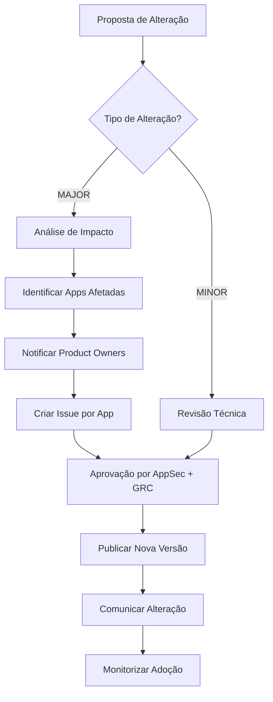

# 📜 Versionamento e Rastreabilidade Histórica de Requisitos

## 🎯 Objetivo

Este addon estabelece o **modelo de versionamento de requisitos de segurança** e os procedimentos de gestão de alterações, garantindo que:
- Cada requisito tem **histórico completo** de alterações (quem, quando, por quê)
- Decisões são **rastreáveis e auditáveis** (conformidade NIS2, DORA, ISO 27001)
- Alterações de requisitos disparam **análise de impacto** em aplicações que os utilizam
- **Reprodutibilidade**: Capacidade de reconstruir catálogo de requisitos de qualquer data passada

**Contexto normativo:**  
Este addon implementa o **Invariante I3 (Reprodutibilidade e auditabilidade)** e **I5 (Rastreabilidade de decisão)** de [agent.md](https://github.com/your-org/agent-spec). É complementar a [addon-11: Validação Assistida por Ferramentas](./11-validacao-requisitos-assistida) e [US-15: Rastreabilidade de Decisões](../aplicacao-lifecycle#us-15---rastreabilidade-de-decisões-de-requisitos-audit-trail).

---

## 📐 Modelo de Versionamento

### Estrutura de Identificação: `REQ-{DOMINIO}-{NUM}-v{MAJOR}.{MINOR}`

**Componentes:**
- **REQ**: Prefixo fixo para requisitos
- **DOMINIO**: Categoria técnica (AUTH, CRYPTO, DATA, LOG, API, CONFIG, etc.)
- **NUM**: Número sequencial de 3 dígitos (001, 002, ...)
- **vMAJOR.MINOR**: Versão semântica
  - **MAJOR**: Incrementa quando requisito muda substancialmente (critérios, âmbito, controlo aplicado)
  - **MINOR**: Incrementa quando há ajuste sem impacto funcional (clarificação texto, correção typo, adição de exemplo)

**Exemplos:**
```yaml
# Versão inicial
REQ-AUTH-001-v1.0: "Implementar MFA para todos os utilizadores"

# Alteração menor (clarificação)
REQ-AUTH-001-v1.1: "Implementar MFA para todos os utilizadores (TOTP ou FIDO2)"

# Alteração major (mudança de critério)
REQ-AUTH-001-v2.0: "Implementar MFA obrigatório para todos os utilizadores com FIDO2; TOTP permitido apenas em L1"
```

### Quando incrementar versão

| Tipo de Alteração | Incremento | Exemplo |
|---|---|---|
| **Mudança de critério de aceitação** | MAJOR | "MFA recomendado" → "MFA obrigatório" |
| **Mudança de âmbito** | MAJOR | "Aplicável a L2/L3" → "Aplicável a L1/L2/L3" |
| **Mudança de controlo técnico** | MAJOR | "Algoritmo SHA-256" → "Algoritmo SHA-3" |
| **Adição de exceção permitida** | MAJOR | "Sem exceções" → "Exceção permitida se MFA delegado a IdP externo" |
| **Clarificação de texto** | MINOR | "Implementar logs" → "Implementar logs estruturados em formato JSON" |
| **Correção de typo** | MINOR | "autenticaçao" → "autenticação" |
| **Adição de exemplo** | MINOR | Adicionar código de exemplo sem mudar requisito |
| **Atualização de referência normativa** | MINOR | "ASVS 4.0" → "ASVS 4.0.3" (mesma versão major) |

---

## 📝 Processo de Gestão de Alterações

### Workflow de alteração de requisito



### Passo 1: Proposta de Alteração

**Quem pode propor:** Developer, AppSec Engineer, GRC/Compliance, Auditores, Product Owner

**Template de proposta:**
```markdown
---
id: PROP-YYYY-MM-DD-XXX
data: YYYY-MM-DD
autor: [Nome]
papel: [Developer | AppSec | GRC | Auditor]
---

## Requisito Afetado
- **Requisito:** REQ-XXX-YYY-vZ.W
- **Versão atual:** vZ.W
- **Descrição atual:** [Texto do requisito atual]

## Proposta de Alteração
- **Tipo:** [MAJOR | MINOR]
- **Nova versão:** v[Z+1].0 ou vZ.[W+1]
- **Descrição proposta:** [Novo texto do requisito]

## Justificação
[Por quê esta alteração é necessária? Incidente, regulamento novo, melhoria técnica, feedback de auditoria?]

## Impacto Estimado
- **Aplicações afetadas:** [Número estimado ou lista]
- **Esforço de adaptação:** [Baixo | Médio | Alto]
- **Deadline sugerido:** [Data ou "imediato" se crítico]

## Referências
- [Links para incidentes, CVEs, regulamentos, issues]
```

---

### Passo 2: Análise de Impacto (apenas MAJOR)

**Responsável:** AppSec Engineer + GRC/Compliance

**Ações obrigatórias:**
- [ ] **Identificar aplicações que usam o requisito:**
  - [ ] Consultar matriz de rastreamento (Cap 02 US-04)
  - [ ] Listar aplicações por nível (L1/L2/L3)
  - [ ] Estimar esforço de adaptação por aplicação
- [ ] **Avaliar risco de transição:**
  - [ ] Aplicações em produção que podem ser afetadas
  - [ ] Janela de manutenção necessária
  - [ ] Possibilidade de rollback
- [ ] **Notificar Product Owners:**
  - [ ] Email ou issue automática para cada Product Owner de app afetada
  - [ ] Prazo para adaptação (sugerido: 30 dias para L1/L2, 15 dias para L3)
  - [ ] Canal de suporte para dúvidas

**Artefacto:**
- Ficheiro: `analises-impacto/IMPACTO-REQ-XXX-YYY-YYYY-MM-DD.md`
- Conteúdo: Tabela `aplicação | nível | esforço | owner | deadline | status`

---

### Passo 3: Aprovação

**Critérios de aprovação:**

| Tipo de Alteração | Aprovadores Obrigatórios | SLA |
|---|---|---|
| MINOR (clarificação, typo) | AppSec Engineer | 2 dias úteis |
| MAJOR (mudança critério, âmbito) | AppSec Engineer + GRC/Compliance | 5 dias úteis |
| MAJOR com impacto L3 | AppSec Engineer + GRC/Compliance + Gestão Executiva/CISO | 10 dias úteis |

**Aprovação formal:**
- Registo em ferramenta GRC ou issue tracker
- Assinatura digital ou email de aprovação
- Timestamp e justificação de aprovação/rejeição

---

### Passo 4: Publicação de Nova Versão

**Responsável:** GRC/Compliance (publica) + AppSec Engineer (valida técnicamente)

**Ações obrigatórias:**
- [ ] **Criar nova versão do requisito:**
  - [ ] Ficheiro: `catalogo-requisitos/REQ-XXX-YYY-v[nova].md`
  - [ ] Metadata: data publicação, autor da alteração, aprovadores, motivo
  - [ ] Changelog: resumo de alterações vs. versão anterior
- [ ] **Marcar versão anterior como deprecated:**
  - [ ] Tag `[DEPRECATED - Substituído por v[nova]]` em ficheiro antigo
  - [ ] Link para nova versão
  - [ ] Deadline para descontinuação (ex: 6 meses)
- [ ] **Atualizar matriz de rastreamento:**
  - [ ] Aplicações que usam requisito passam a referenciar nova versão
  - [ ] Status: "Migração pendente" até aplicação adaptar
- [ ] **Versionamento em Git:**
  - [ ] Commit com tag `req-version-change`
  - [ ] PR com revisão obrigatória de AppSec
  - [ ] Merge apenas após aprovação formal

---

### Passo 5: Comunicação e Monitorização

**Comunicação:**
- [ ] **Anúncio em canal de equipa** (Slack, Teams, email list)
- [ ] **Atualização em Wiki/Portal** de requisitos
- [ ] **Notificação a Product Owners** de apps afetadas (se MAJOR)
- [ ] **Sessão de Q&A** (se impacto >10 aplicações)

**Monitorização de adoção:**
- [ ] **Dashboard de migração:**
  - [ ] Total de aplicações afetadas
  - [ ] % de aplicações já migradas
  - [ ] % de aplicações com migração pendente
  - [ ] Aplicações com deadline ultrapassado (alerta)
- [ ] **Follow-up com Product Owners:**
  - [ ] Alerta 7 dias antes do deadline
  - [ ] Escalação a Gestão Executiva se deadline ultrapassado em L3
- [ ] **Revisão pós-migração:**
  - [ ] Após 100% migração (ou deadline expirado), revisão de lições aprendidas
  - [ ] Ajuste de processo se necessário

---

## 📊 Estrutura de Ficheiros de Versionamento

### Directório `catalogo-requisitos/`

```
catalogo-requisitos/
├── REQ-AUTH-001/
│   ├── v1.0.md (inicial - 2024-01-15)
│   ├── v1.1.md (clarificação - 2024-06-10) [DEPRECATED]
│   ├── v2.0.md (critério mudou - 2025-03-20) [ATUAL]
│   └── CHANGELOG.md (histórico completo)
├── REQ-CRYPTO-005/
│   ├── v1.0.md (inicial - 2024-02-01)
│   ├── v2.0.md (algoritmo mudou - 2025-01-10) [ATUAL]
│   └── CHANGELOG.md
└── ...
```

### Template de ficheiro de requisito versionado

```markdown
---
id: REQ-AUTH-001-v2.0
dominio: AUTH
versao: v2.0
data_publicacao: 2025-03-20
autor_alteracao: João Silva (AppSec Engineer)
aprovadores:
  - Maria Costa (GRC/Compliance) - 2025-03-18
  - Carlos Fernandes (CISO) - 2025-03-19
motivo_alteracao: "Reforçar requisito MFA para aplicações L3 após incidente SEC-2025-015"
versao_anterior: v1.1
status: ATUAL
nivel_aplicacao: [L1, L2, L3]
tags: [autenticacao, mfa, fido2, totp]
---

# REQ-AUTH-001-v2.0: Implementar MFA Obrigatório

## Descrição
Todos os utilizadores devem ter Multi-Factor Authentication (MFA) ativo e **obrigatório** (não-opcional).

## Critérios de Aceitação
- **L1:** MFA com TOTP (Google Authenticator, Microsoft Authenticator) ou FIDO2
- **L2:** MFA com TOTP ou FIDO2, não pode ser desativado pelo utilizador
- **L3:** MFA com **FIDO2 obrigatório** (hardware token ou passkey); TOTP permitido apenas como fallback temporário (<30 dias)

## Validação
- [ ] MFA ativo para 100% dos utilizadores (verificar em IdP)
- [ ] Utilizadores não podem desativar MFA (UI não tem opção)
- [ ] L3: FIDO2 configurado, TOTP em uso <5% dos utilizadores

## Exceções Permitidas
- **Contas de serviço:** Podem usar client certificates ou service principals (não-interativo)
- **Integração com IdP externo:** Se IdP externo (Azure AD, Okta) já tem MFA obrigatório, requisito considerado cumprido mas deve ser validado

## Referências Normativas
- ASVS 4.0.3 - 2.1.1: Multi-Factor Authentication
- NIS2 - Artigo 21(2)(a): Autenticação multi-fator
- NIST SP 800-63B - Section 4.2: MFA Requirements

## Changelog vs. v1.1
- **Adicionado:** FIDO2 obrigatório em L3 (antes era opcional)
- **Adicionado:** Exceção para contas de serviço (não existia)
- **Removido:** Opção de MFA opcional em L1 (agora obrigatório em todos os níveis)

## Impacto da Alteração (v1.1 → v2.0)
- **Aplicações afetadas:** 15 aplicações L3 (listadas em analises-impacto/IMPACTO-REQ-AUTH-001-2025-03-20.md)
- **Esforço médio:** 5 dias de desenvolvimento + 2 dias de testes por aplicação
- **Deadline:** 2025-06-30 (3 meses após publicação)
- **Status migração:** 8/15 aplicações migradas (atualizado: 2025-12-01)
```

---

## 🔍 Auditoria e Rastreabilidade

### Queries essenciais para auditoria

**1. Listar todas as versões de um requisito:**
```bash
# Git log de um requisito específico
git log --all --oneline -- catalogo-requisitos/REQ-AUTH-001/*.md

# Output esperado:
# abc1234 REQ-AUTH-001 v2.0: Reforçar MFA em L3
# def5678 REQ-AUTH-001 v1.1: Clarificar TOTP/FIDO2
# ghi9012 REQ-AUTH-001 v1.0: Requisito inicial
```

**2. Reconstruir catálogo de uma data específica:**
```bash
# Checkout de commit de 2024-06-01
git checkout $(git rev-list -n 1 --before="2024-06-01" main)

# Listar requisitos ativos nessa data
find catalogo-requisitos/ -name "*.md" -not -path "*/CHANGELOG.md"
```

**3. Identificar aplicações que ainda usam versão deprecated:**
```bash
# Grep em matriz de rastreamento
grep -r "REQ-AUTH-001-v1" docs/aplicacoes/*/requisitos-aplicados.md

# Output: Aplicações que ainda não migraram para v2.0
```

### Relatórios obrigatórios para compliance

**Relatório Trimestral (L2/L3):**
- Total de requisitos ativos (versão mais recente)
- Total de requisitos deprecated (aguardando migração)
- % de aplicações em compliance com versões atuais
- Requisitos com deadline de migração ultrapassado (alertas críticos)
- Top 5 requisitos mais alterados (candidatos a estabilização)

**Relatório Anual (Auditoria):**
- Histórico completo de alterações (MAJOR + MINOR)
- Justificações de todas as alterações MAJOR
- Aprovações formais (timestamps, aprovadores)
- Incidentes ou não-conformidades relacionados a alterações de requisitos
- Lições aprendidas e melhorias aplicadas ao processo

---

## 🔗 Integração com Outros Artefactos

| Artefacto | Integração com Versionamento |
|---|---|
| [addon-11: Validação Assistida](./11-validacao-requisitos-assistida) | Template 1 (Decisão) regista versão do requisito sugerido vs. aprovado |
| [US-15: Audit Trail](../aplicacao-lifecycle#us-15) | Rastreabilidade de decisões inclui versão de requisito em cada timestamp |
| [addon-07: Validação](./07-validacao-requisitos) | Falsos positivos/negativos podem disparar alteração de requisito (new version) |
| [Catálogo de Requisitos](./catalogo-requisitos) | Fonte master de requisitos versionados |
| [Matriz de Controlos por Risco](./matriz-controlos-por-risco) | Mapeamento L1/L2/L3 referencia versões específicas de requisitos |

---

## 📐 Proporcionalidade por Nível

| Aspecto | L1 | L2 | L3 |
|---|---|---|---|
| **Versionamento obrigatório?** | Recomendado | Obrigatório | Obrigatório |
| **Análise de impacto (MAJOR)** | Opcional | Obrigatório | Obrigatório + Notificação Gestão Executiva |
| **Aprovação de alteração MAJOR** | AppSec Engineer | AppSec + GRC | AppSec + GRC + CISO (se impacto >5 apps) |
| **Deadline para migração** | 6 meses | 3 meses | 1 mês (crítico: 15 dias) |
| **Rastreabilidade histórica** | 2 anos | 5 anos | 7 anos (compliance regulatório) |
| **Relatórios de compliance** | Anual | Trimestral | Trimestral + Ad-hoc (auditorias) |

---

## ✅ Checklist de Implementação

- [ ] Estrutura de directórios `catalogo-requisitos/REQ-XXX-YYY/` criada
- [ ] Template de requisito versionado aplicado a todos os requisitos existentes
- [ ] Git tags configurados para tracking de versões (`req-version-change`)
- [ ] Matriz de rastreamento atualizada com versões de requisitos
- [ ] Dashboard de migração criado (se >10 aplicações)
- [ ] Processo de aprovação de alterações documentado e treinado (AppSec, GRC)
- [ ] Alertas automáticos configurados (deadline de migração, versão deprecated >6 meses)
- [ ] Relatórios de compliance agendados (trimestral para L2/L3)
- [ ] Política organizacional de versionamento aprovada por Gestão Executiva (se aplicável)

---

**Última atualização**: 2026-01-01  
**Versão do addon**: 1.0.0  
**Autores**: GRC/Compliance + AppSec Team  
**Aprovação**: [Nome do CISO/Gestão Executiva] — [Data]
