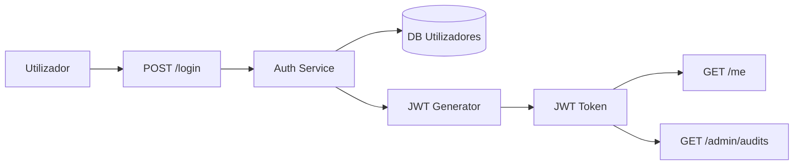

# 🧪 Exemplo Prático - Threat Modeling com LINDDUN

Este exemplo demonstra como aplicar o modelo **LINDDUN** para identificar ameaças à privacidade numa aplicação que processa dados pessoais e autenticação de utilizadores.

O modelo LINDDUN permite identificar ameaças específicas associadas a:

* *Linkability*, *Identifiability*, *Non-repudiation*, *Detectability*, *Disclosure*, *Unawareness*, *Non-compliance*

---

## 🎯 Contexto da aplicação

Serviço de autenticação `auth-service` com as seguintes características:

* Login via formulário (`POST /login` com `email` e `password`)
* Geração de JWT com claims: `sub`, `email`, `role`, `iat`, `exp`
* Endpoint `/me` retorna dados do utilizador autenticado
* Endpoint `/admin/audits` retorna logs e ações do utilizador
* Sem consentimento explícito ou informação sobre retenção de dados

---

## 📈 Modelo de dados e fluxos (DFD simplificado)

---

## 🔍 Ameaças identificadas (modelo LINDDUN)

| Categoria       | Ameaça identificada                                         | Impacto | Requisito associado (Cap. 2)                             |
| --------------- | ----------------------------------------------------------- | ------- | -------------------------------------------------------- |
| Linkability     | JWT permite rastrear utilizadores entre sessões e apps      | Alta    | REQ-DAT-008: JWT não deve conter IDs rastreáveis         |
| Identifiability | Endpoint `/me` expõe `email` e `role` diretamente           | Média   | REQ-DAT-002: Minimizar exposição de dados identificáveis |
| Unawareness     | Utilizador não informado sobre uso dos dados                | Alta    | REQ-PRI-001: Política de privacidade obrigatória         |
| Non-compliance  | Sem registo de consentimento ou base legal                  | Alta    | REQ-PRI-004: Consentimento explícito e auditável         |
| Disclosure      | Logs acessíveis via `/admin/audits` contêm emails completos | Alta    | REQ-LOG-004: Pseudonimização de dados em logs            |

---

## ✅ Recomendações de controlo

* Anonimizar ou pseudonimizar claims sensíveis nos JWT (usar `sub` sem `email`)
* Aplicar RBAC ao endpoint `/admin/audits` e filtrar dados retornados
* Mostrar aviso e link para política de privacidade antes do login
* Implementar registo de consentimento com data, IP e finalidade

---

## 🧭 Validação de requisitos do Cap. 2

Este modelo valida a necessidade de aplicar requisitos das seguintes categorias:

* **Privacidade e Dados Pessoais** (`REQ-DAT-*`)
* **Consentimento e Informação** (`REQ-PRI-*`)
* **Logging e Auditoria** (`REQ-LOG-*`)

Todos os requisitos devem ser:

* Gerados automaticamente a partir do modelo;
* Validados em backlog ou código (ex: commits, testes);
* Rastreáveis no CI/CD ou na ferramenta de threat modeling (ex: IriusRisk).

---

> O uso de LINDDUN permite antecipar riscos legais e operacionais associados a dados pessoais e reforçar a cobertura do Capítulo 2 de forma orientada a ameaças.

---
