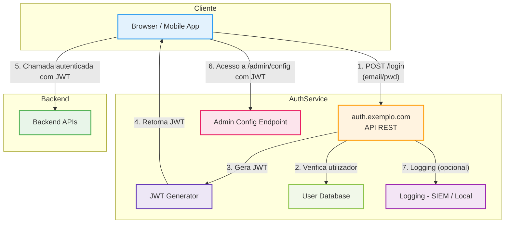

# 🧪 Exemplo prático - Threat Modeling de um serviço de autenticação com JWT

## 🎯 Contexto técnico

Durante a fase de concepção de um novo serviço de autenticação (`auth-service`), a equipa identificou os seguintes componentes e fluxos:

- API REST acessível publicamente em `https://auth.exemplo.com`
- Fluxo de login:
  1. Utilizador submete `email + password` via `POST /login`
  2. O serviço valida as credenciais localmente numa base de dados
  3. Se válidas, o serviço **gera um token JWT**
  4. O JWT é devolvido ao cliente e usado em pedidos futuros (`Authorization: Bearer`)
- Configuração inicial:
  - JWT com `alg: none` (sem assinatura)
  - Claims: `sub`, `email`, `role`, `exp` (24h)
  - Sem MFA
  - Endpoint `/admin/config` acessível com qualquer JWT
  - Sem logging estruturado nem controlo de perfis

---

## 🔁 Modelação com DFD (representação do sistema)

### 🔷 Threat Model - auth-service (DFD em Mermaid)

---

### 🧱 Elementos identificados

| Elemento                | Tipo             | Descrição                                                         |
|-------------------------|------------------|-------------------------------------------------------------------|
| `Browser / Mobile App`  | External Actor   | Cliente que inicia login                                          |
| `auth.exemplo.com`      | Process          | API pública que expõe o endpoint `/login`                         |
| `JWT Generator`         | Process          | Lógica que gera os tokens JWT                                     |
| `User Database`         | Data Store       | Base de dados de utilizadores                                     |
| `SIEM / Logs`           | Data Store       | Armazenamento de eventos estruturado                              |
| `Admin Config Endpoint` | Process          | Endpoint sensível: `/admin/config`                                |
| `Backend APIs`          | Process          | APIs protegidas que consomem e validam o JWT                      |

---

### 🔁 Fluxos de dados

| Fonte                   | Destino              | Dados Transmitidos                                  |
|------------------------|----------------------|-----------------------------------------------------|
| Browser → auth API     | `email/password` via `POST /login` (HTTPS)               |
| auth API → DB          | Consulta de utilizador                                  |
| auth API → JWT Gen     | Pedido de token JWT                                      |
| JWT Gen → Browser      | JWT (`Authorization: Bearer <token>`)                   |
| Browser → Backend APIs | Pedido autenticado com JWT                              |
| Browser → Admin Config | Acesso com JWT a `/admin/config`                        |
| auth API → SIEM        | (Ausente) - sem logs estruturados                       |

---

### 🔍 Ameaças STRIDE por elemento

| Elemento               | Categoria STRIDE         | Ameaça Identificada                                                                | Gravidade | Mitigação Recomendada                                                               |
|------------------------|--------------------------|------------------------------------------------------------------------------------|-----------|--------------------------------------------------------------------------------------|
| `auth.exemplo.com`     | **Spoofing**             | Login com credenciais reutilizadas ou sem MFA                                     | Alta      | MFA, rate limiting, análise de contexto (device/IP)                                |
| `JWT Generator`        | **Tampering**            | JWTs manipuláveis (`alg: none`)                                                    | Alta      | Assinatura RS256, validação do header, TTL reduzido                                |
| `Admin Config`         | **Elevation of Privilege** | Qualquer utilizador pode aceder a endpoints administrativos                        | Alta      | RBAC baseado em claims, validação de `role` no backend                             |
| `auth.exemplo.com`     | **Repudiation**          | Sem registo de login ou alterações sensíveis                                       | Média     | Logging estruturado com `userId`, IP, acção, resultado                             |
| `JWT Generator`        | **Information Disclosure** | Claims excessivos (`email`, `role`, `createdAt`) expostos ao cliente               | Média     | Minimizar claims no JWT, scoping baseado em contexto                               |
| `auth.exemplo.com`     | **Denial of Service**    | Brute-force em `/login` ou reuse massivo de JWTs                                  | Média     | Rate limiting, CAPTCHA, delays progressivos                                        |

---

### 🛡️ Mapa ameaça ↔ controlo

| Ameaça                      | Controlo Recomendado                                                                 |
|----------------------------|----------------------------------------------------------------------------------------|
| Spoofing                   | MFA obrigatório; login context-aware; device binding                                 |
| Tampering                  | JWT assinado (RS256); validação de `alg`, `aud`, `iss`; TTL ≤ 15 min                 |
| Elevation of Privilege     | RBAC com controlo explícito de claims (ex: `role: admin`)                            |
| Repudiation                | Logging centralizado; rastreamento de acções; integração com SIEM                    |
| Information Disclosure     | JWT minimalista; segregação de claims por endpoint; scoping                          |
| Denial of Service          | Rate limiting no endpoint `/login`; protecção no API Gateway; quotas                 |

---

### ✅ Conclusão

Este exemplo ilustra um caso típico de arquitectura moderna com:

- Autenticação baseada em JWT
- API pública acessível via Internet
- Falta de validações e controlos básicos

> Mesmo em arquitecturas aparentemente simples, o **uso indevido de standards** (ex: JWT sem assinatura) pode introduzir **falhas críticas**.  
> O uso de uma abordagem estruturada (ex.: STRIDE) e de uma representação explícita dos fluxos (DFD) permite identificar e mitigar ameaças antes da entrada em produção.

Este modelo de ameaça deve ser documentado, versionado e reutilizado noutros serviços com arquitectura idêntica, conforme descrito na secção “♻️ Reutilização de Threat Models”.
