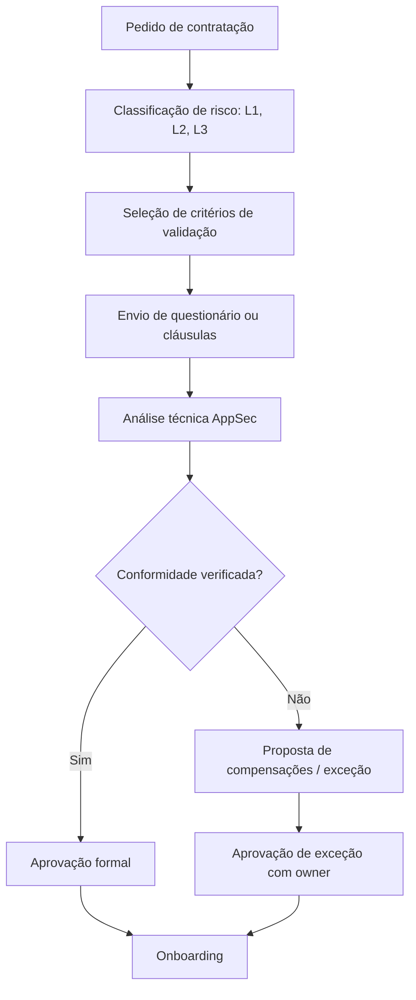

# 🛠️ Modelo de Validação de Fornecedores e Terceiros

## 🌟 Objetivo

Estabelecer um processo formal, proporcional e auditável para:

* Avaliar a adequação de fornecedores e serviços externos conforme o nível de risco;
* Exigir requisitos mínimos de segurança desde a fase de onboarding;
* Registar, justificar e aprovar exceções ou compensações;
* Suportar **due diligence**, rastreabilidade e auditorias de segurança.

---

## 🔁 Como aplicar

### 📊 Fluxo de validação típico

> Este fluxo integra com os capítulos 01 (classificação), 02 (requisitos) e 14.1 (governação).

---

## 🧲 Critérios de validação por risco

| Critério                                  |  L1 |  L2 |  L3 |
| ----------------------------------------- | :-: | :-: | :-: |
| Questionário de segurança                 |  ✔️ |  ✔️ |  ✔️ |
| Cláusulas contratuais de segurança        |  ✔️ |  ✔️ |  ✔️ |
| Validação por equipa AppSec               |     |  ✔️ |  ✔️ |
| Evidência técnica (relatórios, políticas) |     |  ✔️ |  ✔️ |
| SBOM ou inventário de componentes         |     |     |  ✔️ |
| SLA de resposta a incidentes (\<24h)       |     |     |  ✔️ |
| Direito de auditoria                      |     |     |  ✔️ |

> A matriz de criticidade do Cap. 01 deve ser usada como base para atribuição do nível de risco.

---

## 📝 Exemplos práticos

### ✔️ Aprovação normal (nível L2)

* Questionário preenchido com sucesso
* Política de vulnerabilidades apresentada
* Cláusulas contratuais alinhadas com Cap. 2

### ❌ Rejeição (nível L3)

* Recusa de cláusulas sobre incidentes
* Ausência de SBOM ou testes externos
* Rejeitado por não cumprir exigências críticas

### ⚠️ Exceção aprovada (nível L3)

* Fornecedor crítico sem SBOM, mas com scanner próprio
* Aprovado com owner identificado, compensação definida e revisão agendada

---

## 🗂️ Exemplos de questionário de segurança (excerto)

| Área                    | Pergunta                                                   | Obrigatório (L2/L3) |
| ----------------------- | ---------------------------------------------------------- | ------------------- |
| Vulnerabilidades        | Existe política formal de patching com SLA < 7 dias?       | Sim (L2+)           |
| Acessos privilegiados   | MFA é usado para administração remota de sistemas?         | Sim (L2+)           |
| Desenvolvimento seguro  | Adotam ASVS ou práticas equivalentes?                      | Recomendado         |
| Incidentes de segurança | Existe canal 24/7 e plano formal de resposta a incidentes? | Sim (L3)            |
| Transparência / SBOM    | Fornecem SBOM atualizado mediante pedido?                  | Sim (L3)            |

> Pode ser integrado em Forms, Excel, Confluence ou sistemas de procurement.

---

## ✅ Boas práticas

* Aplicar este modelo a todos os fornecedores com acesso a dados, código ou pipelines críticos;
* Formalizar critérios e exceções em sistemas rastreáveis (Git, SharePoint, etc.);
* Rever fornecedores com base em eventos (incidentes, releases, mudanças contratuais);
* Cruzar resultados com os requisitos dos capítulos 01 e 02;
* Envolver GRC e AppSec na aprovação final, sempre que o risco é L3.

---

## 🔗 Referências cruzadas

| Documento / Capítulo              | Relação com validação de fornecedores       |
| --------------------------------- | ------------------------------------------- |
| Cap. 01 - Classificação de risco  | Define o nível de aplicação do modelo       |
| Cap. 02 - Requisitos de segurança | Determina o que validar por tipo de risco   |
| addon/02-clausulas-contratuais.md | Cláusulas por tipo de contrato e risco      |
| addon/01-modelo-governacao.md     | Papéis e alçadas para aprovação de exceções |
| addon/05-exemplos-praticos.md     | Casos reais de aplicação do modelo          |

---
