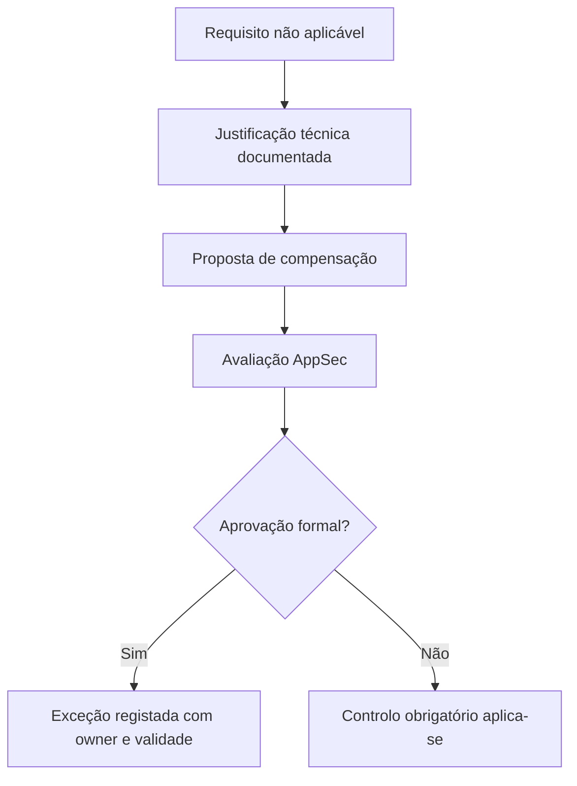
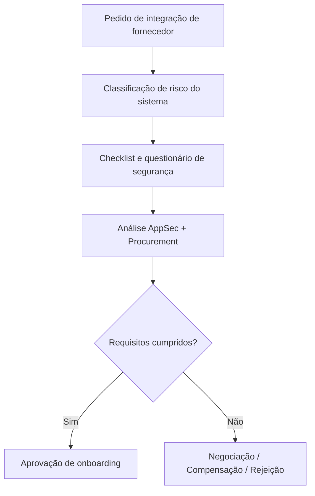
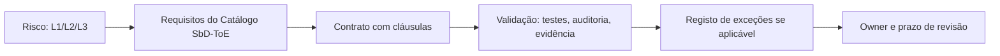
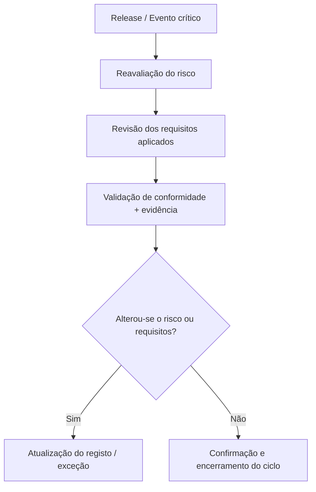

# 🗾️ Diagramas de Apoio à Governança

Este anexo inclui diagramas que representam os principais fluxos de decisão, rastreabilidade e validação descritos no Capítulo 14 - Governança e Contratação.

---

## 📌 1. Fluxo de aprovação de exceção

---

## 📅 2. Onboarding de fornecedor externo

---

## 🔗 3. Rastreabilidade organizacional

---

## 🔄 4. Ciclo de revisão e validação continuada

