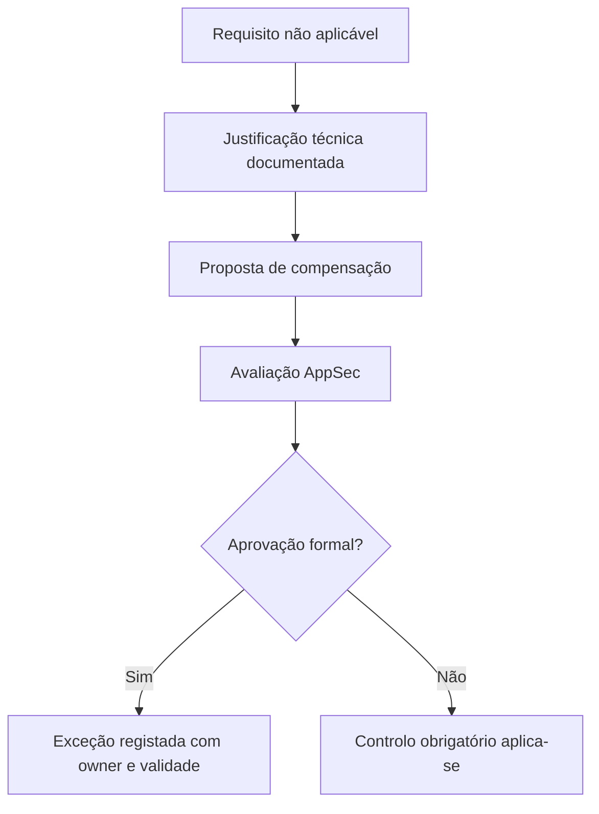
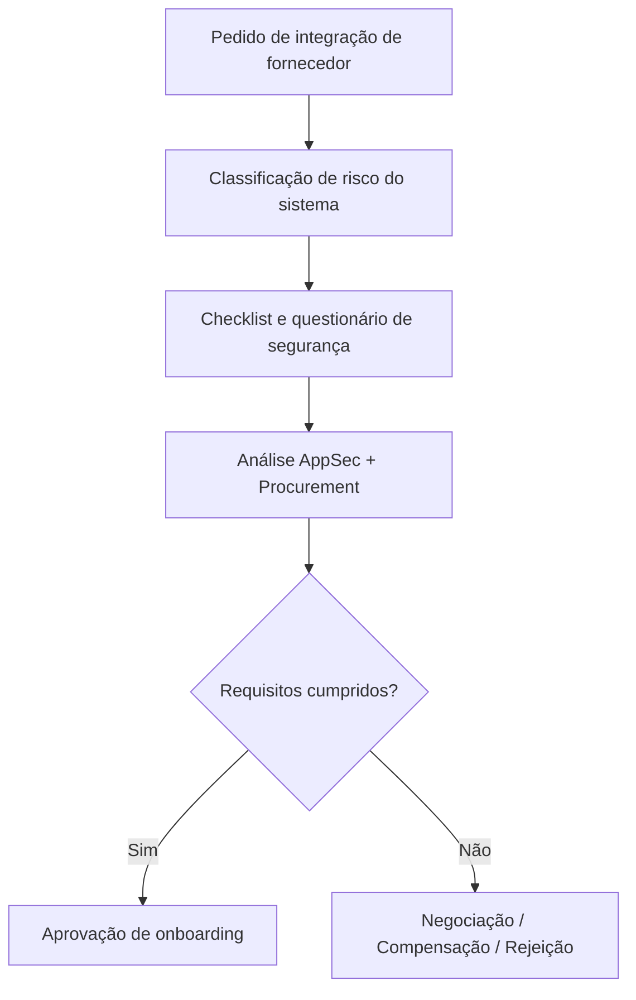
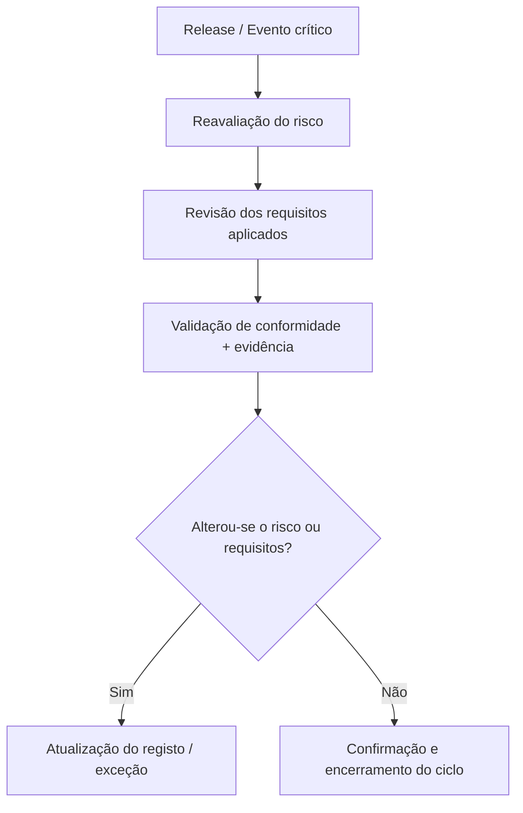
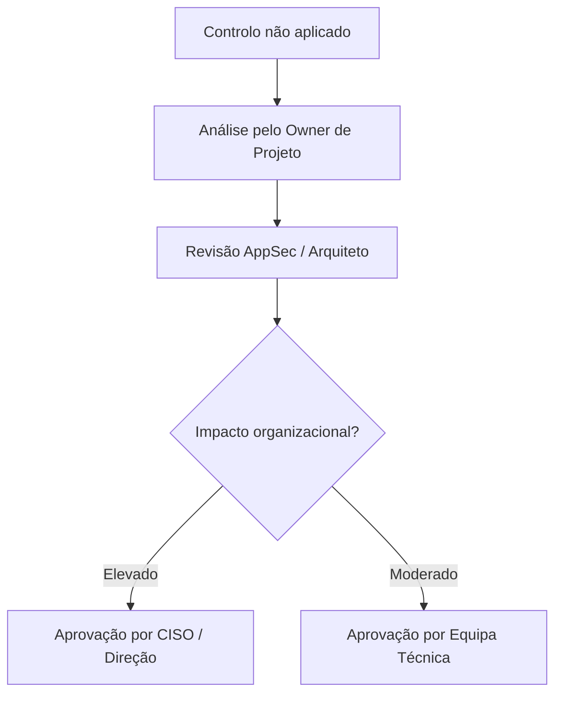
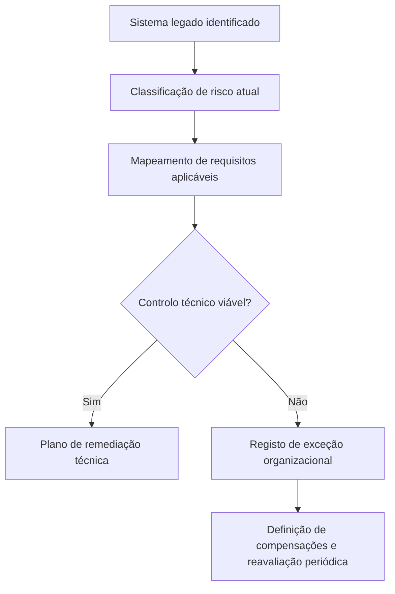

# 🗾️ Diagramas de Apoio à Governança

Este anexo inclui diagramas que representam os principais fluxos de decisão, rastreabilidade e validação descritos no Capítulo 14 — Governança e Contratação.

---

## 📌 1. Fluxo de aprovação de exceção



---

## 📅 2. Onboarding de fornecedor externo



---

## 🔗 3. Rastreabilidade organizacional

```mermaid
flowchart LR
  R[Risco: L1/L2/L3] --> Q[Requisitos do Catálogo SbD-ToE]
  Q --> C[Contrato com cláusulas]
  C --> V[Validação: testes, auditoria, evidência]
  V --> E[Registo de exceções (se aplicável)]
  E --> O[Owner e prazo de revisão]
```

---

## 🔄 4. Ciclo de revisão e validação continuada



---

## 📆 5. Escalonamento de decisão de risco



---

## 🧩 6. Governação de sistemas legados ou não conformes



> 🔍 Este fluxo articula-se com o Capítulo 09 (*containers* e Execução Isolada) e Capítulo 08 (IaC), nos casos de infraestruturas antigas ou pipelines herdados.

---

## 🎓 7. Validação de formação obrigatória por função crítica

```mermaid
flowchart TD
  A[Owner / Aprovador designado] --> B[Verificação de formação SbD (Cap. 13)]
  B --> C{Formação válida (\<12 meses)?}
  C -- Sim --> D[Validação formal autorizada]
  C -- Não --> E[Formação obrigatória antes de validação]
```

> 📚 Este fluxo aplica-se a qualquer capítulo que requeira owners, validadores ou aprovadores formais, e deve ser integrado com o Cap. 13 — Formação e Onboarding.

---

> 📄 Estes diagramas simples podem ser incluídos em relatórios, formação ou documentação de processos. A sua utilização facilita a adoção organizacional e o alinhamento entre equipas técnicas, GRC e gestão executiva.

---
