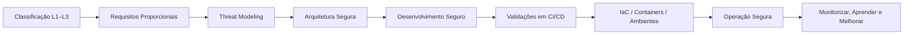

## 🚀 TL;DR — Resumo Executivo do SbD-ToE {#tldr-sbdtoe}

<!--web-only-->
> Esta página fornece uma visão executiva do manual **Security by Design - Theory of Everything (SbD-ToE)** e uma síntese objetiva de cada capítulo.  
> É a camada de leitura rápida para equipas técnicas, gestão, auditores e novos leitores.
<!--/web-only-->

---

## 📘 1. O que é o SbD-ToE? {#o-que-e}
O *Security by Design - Theory of Everything (SbD-ToE)* é um modelo **prescritivo, proporcional e verificável** para construir, validar e operar software seguro em qualquer organização.

Integra princípios de **engenharia segura**, governação, práticas de SDLC, threat modeling, requisitos, arquitetura, dependências, pipelines, IaC, containers, operações e controlo contínuo — tudo com **evidência auditável**, **rastreabilidade global**, **mapeamento a frameworks** (SAMM, SSDF, SLSA, DSOMM) e **checklists canónicos**.

O SbD-ToE funciona como:

- **manual normativo** (prescrições claras, verificáveis e binárias),
- **framework operacional** (como aplicar no ciclo de vida),
- **sistema de maturidade implícito** (alinhamento com modelos internacionais),
- **sistema de governação e evidência** (políticas, artefactos, documentação),
- **padrão organizacional transversal**.

---

## 🧭 2. Como usar o manual (versão curta) {#como-usar}

1. **Classificar a aplicação**  
   Determinar L1/L2/L3 com base em Exposição, Dados e Impacto.

2. **Derivar requisitos proporcionais**  
   Aplicar requisitos técnicos e de governação adequados ao nível.

3. **Modelar ameaças antes do design**  
   Identificar caminhos de abuso e medidas de mitigação.

4. **Desenhar a arquitetura com controlos nativos**  
   Definir fronteiras, zonas de confiança, identidades, segredos e fluxos.

5. **Construir e validar**  
   Pipelines com validações de código, SBOM, assinaturas e políticas.

6. **Tratar infraestruturas como produto**  
   IaC, containers, supply chain, ambientes reprodutíveis.

7. **Operar com evidência**  
   Registos, métricas, auditoria, uso de políticas formais e KPIs.

---

## 🧱 3. Pilares Fundamentais do SbD-ToE {#pilares}

- Classificação proporcional (L1–L3)  
- Requisitos de segurança testáveis  
- Threat Modeling contínuo  
- Arquitetura segura verificável  
- Desenvolvimento seguro e práticas de código  
- Dependências, SBOM e Supply Chain Security  
- Pipelines CI/CD seguros e reprodutíveis  
- Infraestrutura como Código (IaC) como produto  
- Containers e imagens assinadas e verificadas  
- Operação, monitorização, logs e controlo contínuo  
- Governação organizacional e políticas formais  

---

## 🗺️ 4. TL;DR por capítulo {#tldr-capitulos}

> Cada síntese aponta para o capítulo correspondente com ligações absolutas.

## 📘 Capítulo 01 — Classificação de Aplicações {#tldr-cap01}
- Define o nível L1/L2/L3 com base em Exposição, Dados e Impacto.  
- Obriga à documentação do nível para cada aplicação/projeto.  
- Determina toda a proporcionalidade do manual.  
- Evidências: classificação E+D+I, registo no repositório, aceitação formal.

- [Abrir capítulo](/sbd-toe/sbd-manual/classificacao-aplicacoes/intro)
- [Ver checklist](/sbd-toe/sbd-manual/classificacao-aplicacoes/canon/checklist-revisao)

---

## 📘 Capítulo 02 — Requisitos de Segurança {#tldr-cap02}
- Catálogo prescritivo e testável de requisitos L1–L3.  
- Rastreabilidade global a frameworks (SSDF, SAMM, SLSA, etc.).  
- Validação prática recomendada por requisito.  
- Evidências: matriz de requisitos, validações, registos por sprint.

- [Abrir capítulo](/sbd-toe/sbd-manual/requisitos-seguranca/intro)
- [Ver checklist](/sbd-toe/sbd-manual/requisitos-seguranca/canon/checklist-revisao)

---

## 📘 Capítulo 03 — Threat Modeling {#tldr-cap03}
- Identificação sistemática de ameaças e caminhos de abuso.  
- Integração com design, arquitetura e requisitos.  
- Aplicação proporcional por nível L1–L3.  
- Evidências: diagramas, cenários de abuso, mitigação integrada.

- [Abrir capítulo](/sbd-toe/sbd-manual/threat-modeling/intro)
- [Aplicação no ciclo de vida](/sbd-toe/sbd-manual/threat-modeling/aplicacao-lifecycle)

---

## 📘 Capítulo 04 — Arquitetura Segura {#tldr-cap04}
- Zonas de confiança, fronteiras, fluxos, identidades e segredos.  
- Requisitos ARC-XXX específicos por domínio.  
- Mapeamento de ameaças e controlos nativos.  
- Evidências: diagramas, ADRs, controlo de segredos e fluxos.

- [Abrir capítulo](/sbd-toe/sbd-manual/arquitetura-segura/intro)
- [Ver ameaças mitigadas](/sbd-toe/sbd-manual/arquitetura-segura/canon/ameacas-mitigadas)

---

## 📘 Capítulo 05 — Dependências, SBOM e SCA {#tldr-cap05}
- Gestão robusta de dependências e da cadeia de fornecimento.  
- SBOM obrigatório, assinado e versionado.  
- Governação de exceções e validações contínuas.  
- Evidências: SBOM, relatórios SCA, pipeline de validação.

- [Abrir capítulo](/sbd-toe/sbd-manual/dependencias-sbom-sca/intro)
- [Ver checklist](/sbd-toe/sbd-manual/dependencias-sbom-sca/canon/checklist-revisao)

---

## 📘 Capítulo 06 — Desenvolvimento Seguro {#tldr-cap06}
- Linters, secret scanning, guidelines e práticas por linguagem.  
- Integração no IDE e no pipeline de integração contínua.  
- Evidências: logs de scans, branches protegidas, revisões seguras.

- [Abrir capítulo](/sbd-toe/sbd-manual/desenvolvimento-seguro/intro)
- [Aplicação no ciclo de vida](/sbd-toe/sbd-manual/desenvolvimento-seguro/aplicacao-lifecycle)

---

## 📘 Capítulo 07 — CI/CD Seguro {#tldr-cap07}
- Pipelines tratados como produto seguro.  
- Execução isolada, runners confiáveis, assinaturas e políticas.  
- Evidências: logs, regras de publicação, cadeias reprodutíveis.

- [Abrir capítulo](/sbd-toe/sbd-manual/cicd-seguro/intro)
- [Aplicação no ciclo de vida](/sbd-toe/sbd-manual/cicd-seguro/aplicacao-lifecycle)

---

## 📘 Capítulo 08 — IaC Seguro {#tldr-cap08}
- IaC tratado como produto de software.  
- Validações, módulos aprovados, ambientes reprodutíveis.  
- Evidências: relatórios de lint/policies, módulos assinados, tags.

- [Abrir capítulo](/sbd-toe/sbd-manual/iac-infraestrutura/intro)
- [Ver checklist](/sbd-toe/sbd-manual/iac-infraestrutura/canon/checklist-revisao)

---

## 📘 Capítulo 09 — Containers e Imagens {#tldr-cap09}
- Imagens assinadas, reprodutíveis e verificadas.  
- Registos com RBAC forte e políticas de retenção e publicação.  
- Evidências: assinatura, SBOM, logs de publicação, scans de segurança.

- [Abrir capítulo](/sbd-toe/sbd-manual/containers-imagens/intro)
- [Ver ameaças mitigadas](/sbd-toe/sbd-manual/containers-imagens/canon/ameacas-mitigadas)

---

## 📘 Capítulo 10 — Testes de Segurança {#tldr-cap10}
- Testes estáticos, dinâmicos, IAST, fuzzing, manual e exploratório.  
- Proporcionalidade por nível L1–L3.  
- Evidências: relatórios, reprodutibilidade, aceitação formal de resultados.

- [Abrir capítulo](/sbd-toe/sbd-manual/testes-seguranca/intro)

---

## 📘 Capítulo 11 — Deploy Seguro {#tldr-cap11}
- Releases promovidas apenas a partir de artefactos assinados, rastreáveis e aprovados.  
- Gates de segurança, validação em staging e rollback testado antes da promoção.  
- Evidências: aprovações, proveniência, registos de deploy e rollback.

- [Abrir capítulo](/sbd-toe/sbd-manual/deploy-seguro/intro)
- [Aplicação no ciclo de vida](/sbd-toe/sbd-manual/deploy-seguro/aplicacao-lifecycle)

---

## 📘 Capítulo 12 — Monitorização e Operações {#tldr-cap12}
- Logging estruturado, métricas, alertas e integração com resposta a incidentes.  
- Correlação em SIEM/SOAR, tuning de alertas e medição de MTTD/MTTR.  
- Evidências: dashboards, playbooks, alertas testados e relatórios operacionais.

- [Abrir capítulo](/sbd-toe/sbd-manual/monitorizacao-operacoes/intro)
- [Aplicação no ciclo de vida](/sbd-toe/sbd-manual/monitorizacao-operacoes/aplicacao-lifecycle)

---

## 📘 Capítulo 13 — Formação e Capacitação {#tldr-cap13}
- Onboarding seguro, formação contínua por perfil e programas de security champions.  
- Labs, exercícios práticos e métricas de eficácia para consolidar cultura e execução.  
- Evidências: planos formativos, taxas de conclusão, KPIs e trilhos por papel.

- [Abrir capítulo](/sbd-toe/sbd-manual/formacao-onboarding/intro)
- [Aplicação no ciclo de vida](/sbd-toe/sbd-manual/formacao-onboarding/aplicacao-lifecycle)

---

## 📘 Capítulo 14 — Governação e Contratação {#tldr-cap14}
- Relação com fornecedores, requisitos contratuais, validação contínua.  
- Governação organizacional, métricas e indicadores.  
- Evidências: contratos, SLA de segurança, dashboards de conformidade.

- [Abrir capítulo](/sbd-toe/sbd-manual/governanca-contratacao/intro)
- [Aplicação no ciclo de vida](/sbd-toe/sbd-manual/governanca-contratacao/aplicacao-lifecycle)

---

## 🧭 5. Fluxo Operativo (SbD-ToE em 1 página) {#fluxo-operativo}

---

## 📊 6. Maturidade (visão resumida) {#maturidade}

- **SAMM** — coberturas relevantes em design, implementação, verificação e operações.  
- **SSDF** — práticas alinhadas em governança, proteção, análise e verificação.  
- **SLSA** — foco em integridade de pipeline e proveniência de artefactos.  
- **DSOMM** — reforço contínuo de práticas DevSecOps.

Quando aplicado de forma consistente, o SbD-ToE coloca a organização num patamar intermédio/sólido destes modelos, com margem clara para evoluções avançadas descritas nos capítulos de governação e recomendações.

---

## 🔗 7. Ligações úteis {#links}

- [Theory of Everything](/sbd-toe/teory-of-everything/intro)
- [Cross-check normativo](/sbd-toe/cross-check-normativo/intro)
- [Índice do manual](/sbd-toe/sbd-manual/)

---

## 🏁 8. Conclusão Executiva {#conclusao}

O SbD-ToE fornece uma arquitetura completa para transformar segurança de software numa prática **sistemática, mensurável e auditável**, transversal a toda a organização.

Esta página concentra a visão rápida do todo e permite navegar para qualquer capítulo em segundos, sem substituir o conteúdo normativo e detalhado de cada `intro.md` e respetivos ficheiros `canon/`.
